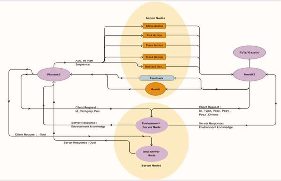

# Autonomous Voice Controlled Arm Robot (A.V.C.A.R)

**Final Year Project – B.E. Computer Science & Engineering (2023–24)**  
BMS Institute of Technology & Management, Bengaluru  
Visvesvaraya Technological University, Belagavi  

---

## 📌 Overview
The **Autonomous Voice Controlled Arm Robot (A.V.C.A.R)** is a simulated assistive robotics project developed using **ROS2 Humble**, **PlanSys2**, **MoveIt2**, **YOLOv8**, and **Speech Recognition APIs**.  

The system enables a simulated robotic arm to:
- Understand **voice commands** from the user.  
- Perform **object detection** and localization using YOLOv8.  
- Generate autonomous **task plans** via PlanSys2 (PDDL-based planner).  
- Execute **pick-and-place motions** using MoveIt2 within Gazebo.  

This work demonstrates the feasibility of combining **AI perception**, **symbolic planning**, and **motion control** in a single ROS2 pipeline for assistive robotics.  

---

## 🎥 Demo
A short video demonstration of the project can be viewed here:  
👉 [Demo Video](./avcar_demo_video.mp4)  

---

## 📖 Documentation
For detailed methodology, architecture, and testing results, please refer to:  
- [📄 Final Year Thesis (PDF)](./Final%20Year%20Thesis.pdf)

---

## 🛠️ Tech Stack
- **ROS2 Humble** – Middleware for robotics applications  
- **PlanSys2** – PDDL-based planning framework for task sequencing  
- **MoveIt2** – Motion planning and execution  
- **Gazebo & RViz2** – Simulation and visualization  
- **YOLOv8 (Lite)** – Object detection  
- **Speechmatics API** – Speech-to-text transcription  
- **Gemini API** – Natural language to PDDL translation  
- **Python (rclpy)** & **C++ (rclcpp)** – ROS2 client libraries  

---

## ⚙️ System Architecture
The **Autonomous Voice Controlled Arm Robot (A.V.C.A.R.)** is designed as a modular ROS2 system that integrates **voice recognition, object perception, task planning, and motion execution** in a unified simulation pipeline.  

---

### 🔹 Voice Control Module

- Captures user speech.  
- Converts speech to text using **Speechmatics API**.  
- Parses text into structured **PDDL goals** for the planner.  

---

### 🔹 Perception Module

- Processes input from the robot’s camera.  
- Detects and localizes objects using **YOLOv8**.  
- Publishes detection results (labels, bounding boxes, confidence scores) as ROS2 messages.  

---

### 🔹 Task Planning Module

- Uses **PlanSys2** (PDDL-based planner).  
- Consumes environment facts + user goals.  
- Generates multi-step symbolic action sequences (e.g., pick, place, move).  
- Supports **replanning** in case of failure.  

---

### 🔹 Motion Planning & Execution Module

- Uses **MoveIt2** to compute collision-free trajectories.  
- Executes actions in **Gazebo** (simulation) or on a physical robotic arm.  
- Provides real-time visualization in **RViz2**. 

---

### 🔹 ROS2 Node Architecture

  
   
  <em>Fig. 2 – ROS2 nodes and communication between modules.</em>

The system is implemented as a collection of independent ROS2 nodes.  
Each node handles a specific function, and communication occurs through **ROS2 Actions and Services**.  

- **Environment Server Node (Perception Module)**  
  - Input: camera feed from the robot/simulator.  
  - Extracts environment facts (objects, positions).  
  - Shares data with both **PlanSys2** and **MoveIt2**.  

- **Goal Server Node (Voice Command Interface)**  
  - Input: user voice command (via speech recognition).  
  - Converts transcribed text into structured task goals.  
  - Sends goals to the **PlanSys2 Node**.  

- **PlanSys2 Node (Task Planner)**  
  - Core symbolic planner.  
  - Consumes environment facts + user goals.  
  - Generates multi-step symbolic action sequences.  

- **Action Nodes (Task Executors & Feedback)**  
  - Bridge between **PlanSys2** and **MoveIt2**.  
  - Provide feedback to the planner.  
  - Send task execution requests (pick, place, move) to **MoveIt2**.  

- **MoveIt2 Node (Motion Planning & Execution)**  
  - Receives execution requests from Action Nodes.  
  - Plans collision-free trajectories using environment data.  
  - Executes motion in **Gazebo** (simulation) or on the robotic arm (hardware).  

- **ROS2 Humble Middleware**  
  - Acts as the communication backbone.  
  - Provides **Services** (e.g., Environment Service, Goal Service) and **Actions** (PlanSys2 ↔ Action Nodes ↔ MoveIt2).  

---

### 🔹 Data Flow

  

  
  

   
  <em>Fig. 3 – Data flow from user voice command to robotic arm execution in Gazebo.</em>

1. User gives a **voice command**.  
2. **Voice Control Module** → converts audio to text → generates PDDL goal.  
3. **Task Planning Module** → PlanSys2 generates symbolic action plan.  
4. **Perception Module** → YOLOv8 provides detected objects to the planner.  
5. **Motion Planning & Execution Module** → MoveIt2 generates trajectories.  
6. **Gazebo & RViz2** → simulate and visualize execution.  

---

📌 **Scalability:** This modular design allows easy extension — e.g., swapping the simulated camera with a real one, expanding the action set in the planner, or deploying the same control pipeline to a physical robotic arm.

---

## 🚀 Features
- Natural language interaction through **voice commands**.  
- Autonomous **task sequencing** with automatic replanning on failures.  
- Integration of **deep learning–based object detection** with symbolic planning.  
- Full simulation in **Gazebo** with a URDF-based robotic arm model.  

---

## 📊 Results
- YOLOv8 trained on a custom dataset (3 object classes) – achieved ~80% detection accuracy.  
- Plansys2 generated task plans averaging **6–7 steps per command**.  
- Successful pick-and-place operations demonstrated in Gazebo.  

---

## 👨‍💻 Team
- [Chaitra Sri Naidu](https://github.com/chytra3)  
- [S Guru Prasad](https://github.com/Guru-Prasad-2002)  
- [Sai Harshit B](https://github.com/HarshitBalaji)  
- [Vigneshwaran P S](https://github.com/Vigneshwaran30)  

Under the guidance of **Dr. Ambika G N**, Assistant Professor, Dept. of CSE, BMSIT&M.

---

## 📌 Ongoing Work
- Full real-time integration of YOLOv8 into ROS2 pipeline.  
- Hardware implementation on a physical robotic arm.  
- Expanded dataset and improved multi-object grasping.  

---
